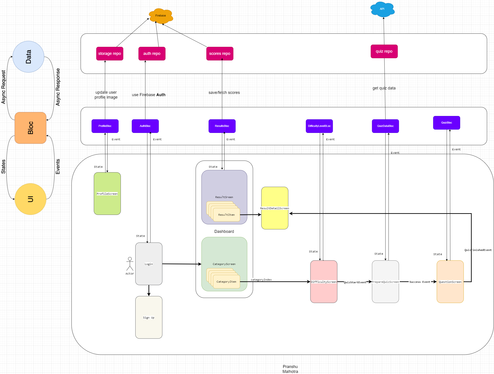
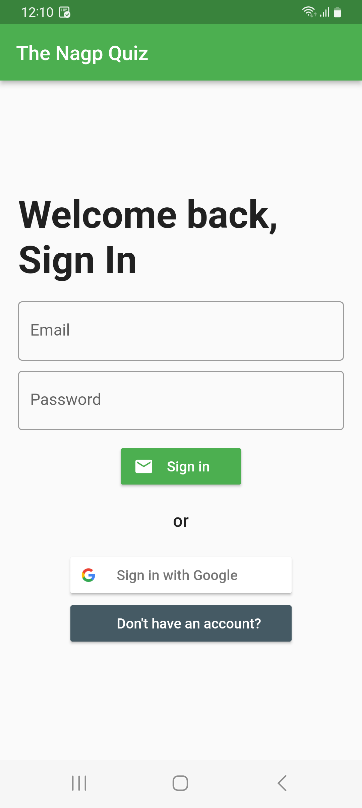
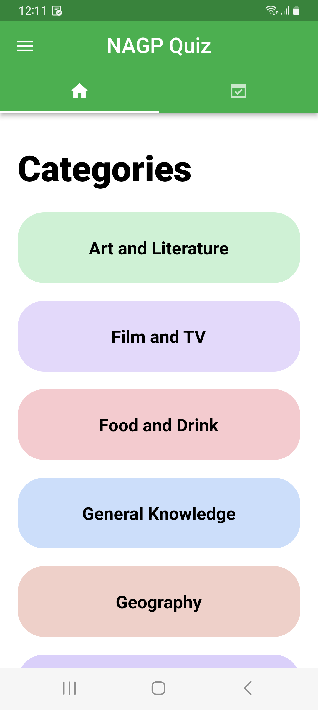
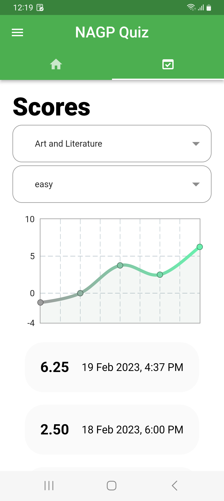
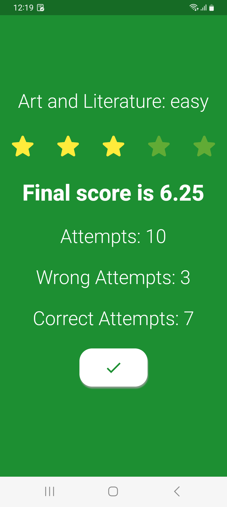

## Bloc Quiz - Flutter

###### Download
[](https://github.com/osmium8/bloc-quiz/blob/main/app-release.apk)

###### Diagram [draw.io](https://github.com/osmium8/bloc-quiz/blob/main/diagram.drawio)



###### Build From Source:
1. import in Android Studio IDE (with Flutter Plugin installed)
2. `flutter pub get`
3. setup a new Firebase project, generate `google-services.json` and paste it at `./android/app` directory


|Auth|Home|Quiz|Scores|Result|Profile|
|-----------|-----|-----|-----|-----|-----|
|||||||

###### Features:
* BLOC architecture
* Firebase
    * Authentication
    * Firestore Database: for stroing scores
    * Storage: for storing user profile image file
* Fetch quiz from Rest API: `the-trivia-api.com`
* Compare performance for each category and difficulty level over last 10 scores


```
+---lib
|   |   main.dart
|   |   
|   +---bloc
|   |   +---auth
|   |   |       auth_bloc.dart
|   |   |       auth_event.dart
|   |   |       auth_state.dart
|   |   |       
|   |   +---difficulty_level
|   |   |       difficulty_level_bloc.dart
|   |   |       difficulty_level_event.dart
|   |   |       difficulty_level_state.dart
|   |   |       
|   |   +---profile
|   |   |       profile_bloc.dart
|   |   |       profile_event.dart
|   |   |       profile_state.dart
|   |   |       
|   |   +---quiz
|   |   |       quiz_bloc.dart
|   |   |       quiz_event.dart
|   |   |       quiz_state.dart
|   |   |       
|   |   +---quiz_data
|   |   |       quiz_data_bloc.dart
|   |   |       quiz_data_event.dart
|   |   |       quiz_data_state.dart
|   |   |       
|   |   \---results
|   |           results_bloc.dart
|   |           results_event.dart
|   |           results_state.dart
|   |           
|   +---data
|   |   +---model
|   |   |       category.dart
|   |   |       questions.dart
|   |   |       score.dart
|   |   |       
|   |   \---repositories
|   |           auth_repository.dart
|   |           quiz_repo.dart
|   |           result_repo.dart
|   |           storage_repo.dart
|   |           
|   +---presentation
|   |   +---auth
|   |   |   +---sign_in
|   |   |   |       sign_in.dart
|   |   |   |       
|   |   |   \---sign_up
|   |   |           sign_up.dart
|   |   |           
|   |   +---dashboard
|   |   |   |   dashboard.dart
|   |   |   |   
|   |   |   +---categories
|   |   |   |       categories_screen.dart
|   |   |   |       category_item.dart
|   |   |   |       
|   |   |   \---result
|   |   |           results_screen.dart
|   |   |           result_item.dart
|   |   |           
|   |   +---main
|   |   |       difficulty_selection_screen.dart
|   |   |       prepare_quiz_screen.dart
|   |   |       question_screen.dart
|   |   |       result_detail_screen.dart
|   |   |       
|   |   \---profile
|   |           profile.dart
|   |           
|   +---utility
|   |       category_detail_list.dart
|   |       prepare_quiz.dart
|   |       
|   \---widgets
|           close_button.dart
|           difficulty_level_widget.dart
|           option_widget.dart
```
